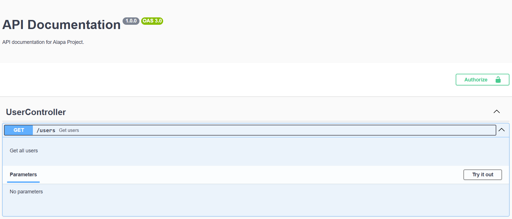
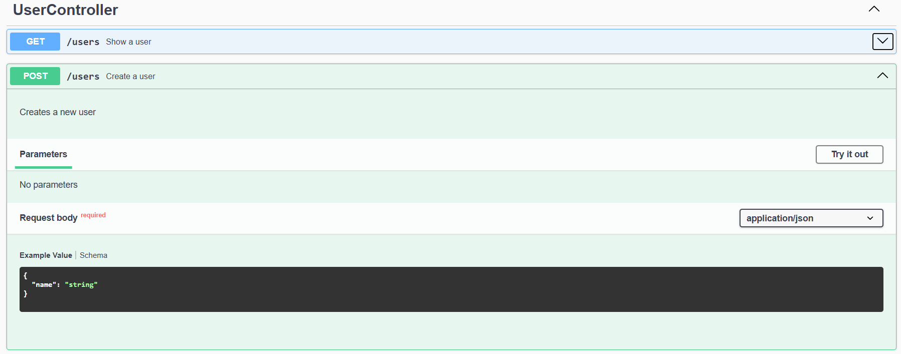
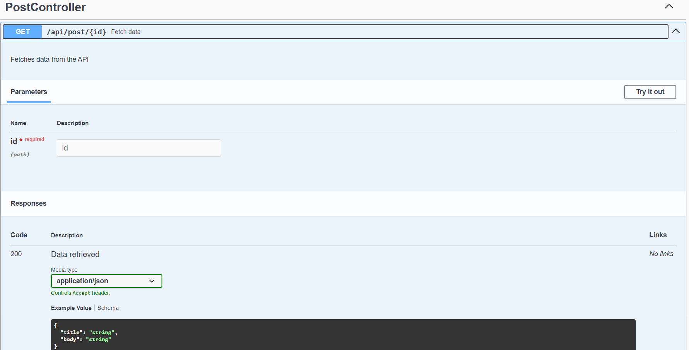

# Generate API Documentation

Alapa offers a set of powerful decorators that allow developers to automatically generate API documentation in a clean, consistent,
and maintainable way. These decorators are designed to work seamlessly with Alapa's routing and controller system, which means you
can focus on building the application’s core features without worrying about the tedious task of maintaining accurate and up-to-date
API documentation.

## Introduction to Alapa's API Documentation Decorators

Alapa's decorators are designed to streamline the process of documenting APIs by allowing developers to define OpenAPI specifications directly within their code. This approach ensures that the documentation is always in sync with the actual implementation, reducing the risk of discrepancies and making it easier to maintain.

---

## Key Decorators

### 1. `@OpenApiOperation`

The `@OpenApiOperation` decorator is used to define OpenAPI specifications for individual methods within a controller or resourceful
class. It is particularly useful for documenting methods where the HTTP method and path are automatically generated by Alapa's
routing system. This decorator automatically binds the OpenAPI definition to the method's HTTP verb and route.

#### Example:

<CodeScreen title="src/api/users/Controller.ts">

```ts
import { Controller, OpenApiOperation, Request, Response } from "alapa";
import { Users } from "../../models/user";

export class UserController extends Controller {
  @OpenApiOperation({
    summary: "Get users",
    description: "Get all users",
  })
  async getIndex(req: Request, res: Response) {
    const users = Users.find();
    res.api({
      status: "success",
      data: users,
      message: "Users retrieved successfully",
    });
  }
}
```

</CodeScreen>

<BrowserWindow title="/docs/#/UserController/get-users">
  
</BrowserWindow>

### 2. `@OpenApiPathMethod`

The `@OpenApiPathMethod` decorator is used to define multiple HTTP methods (e.g., `GET`, `POST`, `PUT`, `DELETE`) for the same endpoint.
This is particularly useful when a single route supports multiple operations, and you want to document them in one place.

#### Example:

<CodeScreen title="src/api/users/Controller.ts">

```typescript
import { Controller, OpenApiPathMethod, Request, Response } from "alapa";
import { Users } from "../../models/user";

export class UserController extends Controller {
  @OpenApiPathMethod({
    get: {
      summary: "Show a user",
      description: "Shows a user",
      responses: {
        200: {
          description: "User retrieved",
          content: {
            "application/json": {
              schema: {
                type: "object",
                properties: {
                  id: { type: "integer" },
                  name: { type: "string" },
                },
              },
            },
          },
        },
      },
    },
    post: {
      summary: "Create a user",
      description: "Creates a new user",
      requestBody: {
        required: true,
        content: {
          "application/json": {
            schema: {
              type: "object",
              properties: {
                name: { type: "string" },
              },
            },
          },
        },
      },
    },
  })
  async getIndex(req: Request, res: Response) {
    if (req.method === "GET") {
      const users = await Users.find();
      res.api({
        status: "success",
        data: users,
        message: "Users retrieved successfully",
      });
    } else if (req.method === "post") {
      // Handle POST requests
    }
  }
}
```

</CodeScreen>
<BrowserWindow title="/docs/#/UserController/post-users">
  
</BrowserWindow>

---

### 3. `@OpenApiPath`

The `@OpenApiPath` decorator is used to define OpenAPI documentation for a specific route path and its associated HTTP methods. It allows you to document an entire endpoint, including all supported methods, in one place.

#### Example:

<CodeScreen title="src/api/users/Controller.ts">

```typescript
import { Controller, OpenApiPath, Request, Response } from "alapa";

export class PostController extends Controller {
  @OpenApiPath("/api/post/{id}", {
    get: {
      summary: "Fetch data",
      description: "Fetches data from the API",
      parameters: [
        {
          name: "id",
          in: "path",
          required: true,
        },
      ],
      responses: {
        200: {
          description: "Data retrieved",
          content: {
            "application/json": {
              schema: {
                type: "object",
                properties: {
                  title: { type: "string" },
                  body: { type: "string" },
                },
              },
            },
          },
        },
      },
    },
  })
  test(req: Request, res: Response) {
    const id = req.params.id;
    res.json({
      title: "Sample Post Title",
      body: `Lorem ipsum dolor sit amet, consectetur adipiscing elit.`,
    });
  }
}
```

</CodeScreen>

<BrowserWindow title="/docs/#/UserController/post-users">
  
</BrowserWindow>

---

## Summary

Alapa's decorators provide a powerful and flexible way to generate API documentation directly within your code. By using `@OpenApiOperation`, `@OpenApiPathMethod`, and `@OpenApiPath`, you can ensure that your documentation is always accurate, up-to-date, and easy to maintain. These tools not only save time but also improve the overall quality and consistency of your API documentation.
